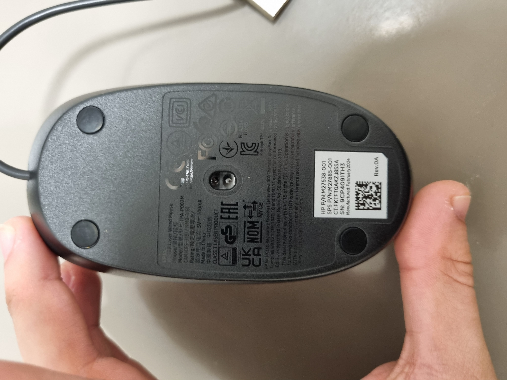
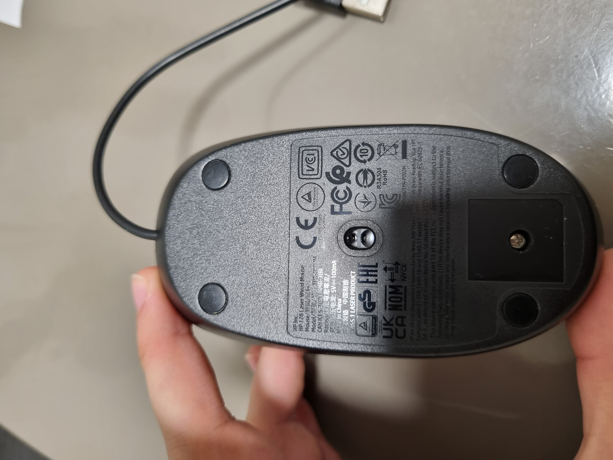
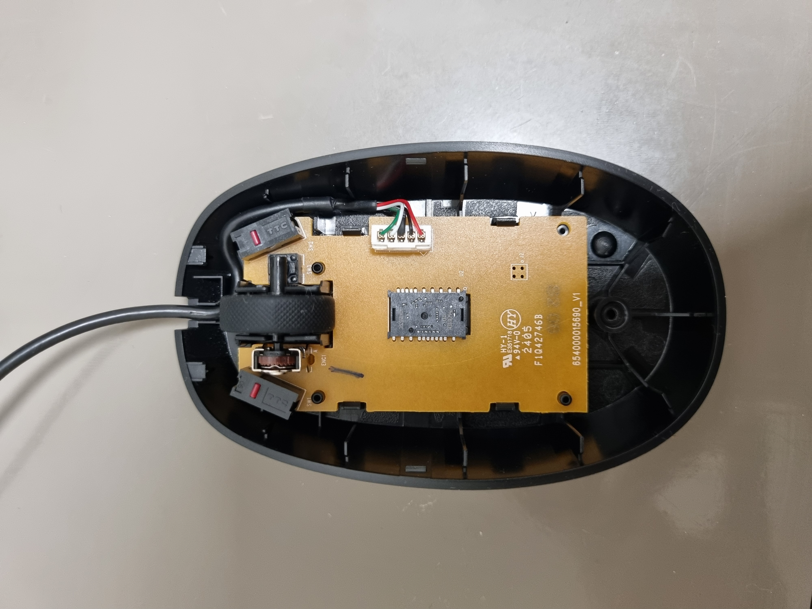
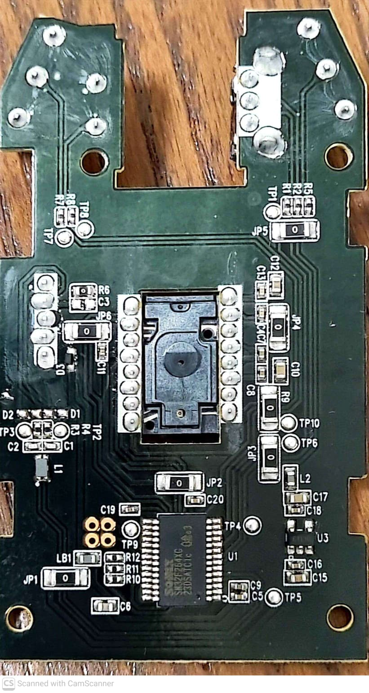
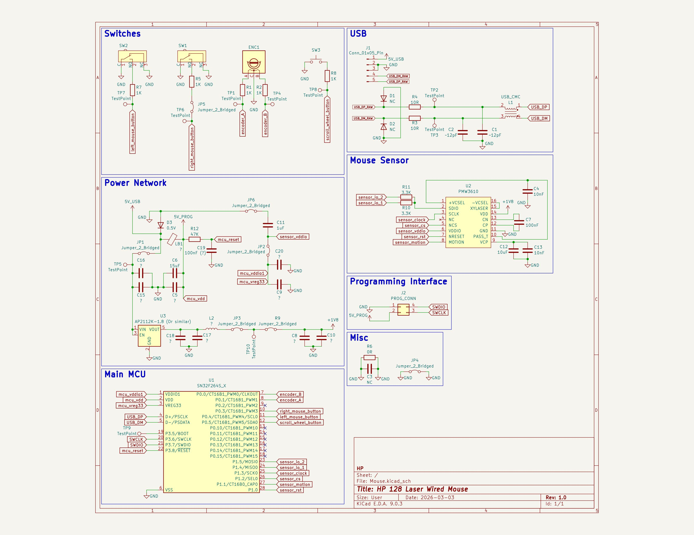

# HP 128 Laser Wired Mouse Reverse Engineering 🖱️🔍

> **Disclaimer:** This project is strictly for **educational purposes**. The HP 128 laser mouse and its original design are the intellectual property of HP. This repository serves as a study in hardware reverse engineering, component analysis, and PCB layout techniques.

## What this is
This project is a complete, bottom-up reverse engineering of the HP 128 laser wired mouse. The goal of this research was to create a near-perfect, 1:1 functional clone of the original PCB. Every trace, jumper, component footprint, and silkscreen marking has been meticulously recreated to match the original factory board.

### Side-By-Side

#### Back:

    

#### Front:

    

## Teardown

<table>
  <thead>
    <tr>
      <th style="width:50%; text-align:center;">1</th>
      <th style="width:50%; text-align:center;">2</th>
    </tr>
  </thead>
  <tbody>
    <tr>
      <td style="text-align:center;">
        
        <h3>Initial inspection</h3>
        
The writing on the mouse is documenting identifying details, including the model number "TPA-P002M," a specific serial number, and the manufacturing date of "February 2024". The mouse is in its initial, fully assembled state.

      </td>
      <td style="text-align:center;">
        
        <h3>Bottom Screw Access and Disassembly</h3>
        
Remove the sticker to reveal the primary bottom screw. Unscrew the screw and take the unit apart.

      </td>
    </tr>
  </tbody>
  <thead>
    <tr>
      <th style="width:50%; text-align:center;">3</th>
      <th style="width:50%; text-align:center;">4</th>
    </tr>
  </thead>
  <tbody>
    <tr>
      <td style="text-align:center;">
        
        <h3>PCB top side</h3>
        
After removing the screw and separating the top and bottom shells, the top of the pcb is revealed. The visible parts are the microswitches, the scroll wheel and its rotary encoder, the scroll wheel button, the USB connector, and the laser sensor. 

      </td>
      <td style="text-align:center;">
        
        <h3>PCB bottom side</h3>
        
Flipping the board its finally possible to see the entire circuit. Including but not limited to the MCU, LDO, underside of the laser sensor, etc.

      </td>
    </tr>
  </tbody>
</table>

## Component Analysis

The two most interesting components are obviously the MCU and the laser sensor.

### MCU - SN32F264X (SSOP28)

This MCU is a 32-Bit Cortex-M0 Micro-Controller manufactured by Sonix:

https://www.sonix.com.tw/article-en-998-24755

While the datasheet is available and can be downloaded from the linked web page, a footprint for KiCad was not. So I had to create my own footprint for it.

### Laser sensor - PMW3610DM-SUDU

This is a laser sensor with a janky footprint that luckily was already created by two github users:

https://github.com/Good-Great-Grand-Wonderful/pmw3610dm-sudu

https://github.com/siderakb/pmw3610-pcb

Its datasheet is also readily available here:

https://www.epsglobal.com/Media-Library/EPSGlobal/Products/files/pixart/PMW3610DM-SUDU.pdf?ext=.pdf

## Schematic Extraction
A few hours, a digital multimeter in continuity mode, and some close-up images later a schematic was successfully extracted:

Some component values were not measured due to the nee to de-solder them, and at the time of me working on this project I could not find the time to do so. These missing values are left as an exercise for the reader as is commonly said.

## 1:1 PCB Recreation

To recreate the PCB, A close-up image was adjusted to the correct scale and proportions using a website called Photopea:

    

Then, the image was placed in the PCB view in KiCad, and all of the components and traces were places according to the image.

The most attention demanding part were the little things - The silkscreen writings, font sizes, component outlines, etc.

## What's next?
If you want to fabricate your own board or study the layout feel free to do so. 

Once I assemble this board there are a few interesting research directions I would like to go down with the Sonix MCU, and perhaps integrate wireless connectivity for the mouse as well.

